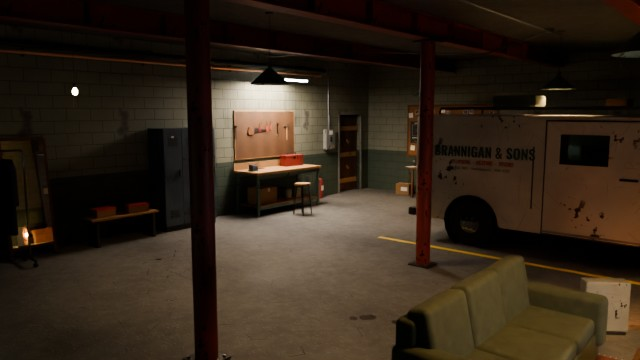
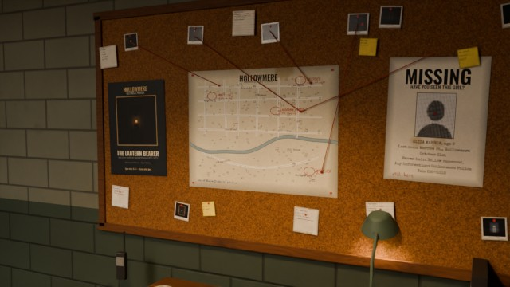
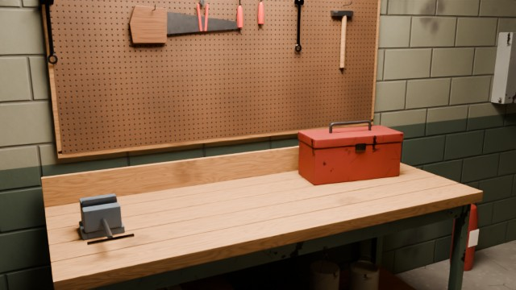
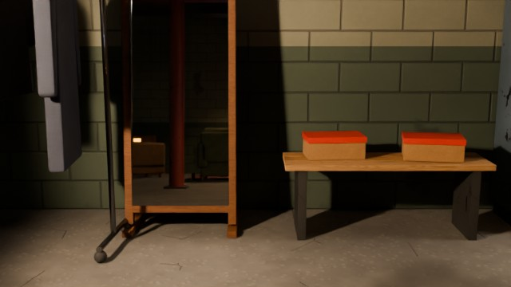
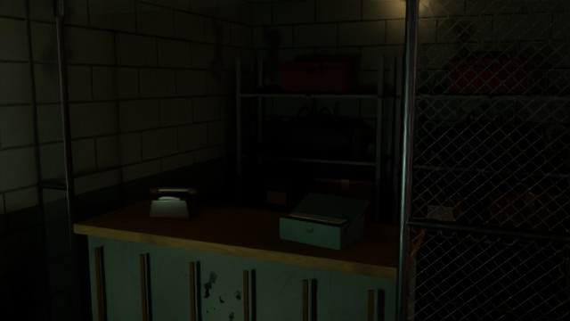
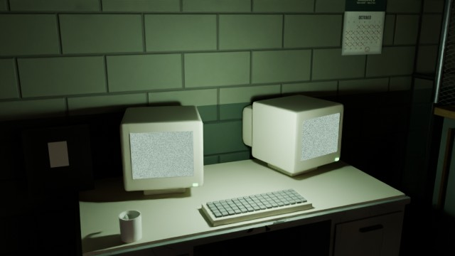

# The Quiet Job – Koop-Horror-Heist (Unreal Engine 5)

> Hollowmere, irgendwann im Oktober. Eine Crew aus bis zu vier Einbrechern plant ihre Jobs im Keller
> unter „Brannigan & Sons Plumbing“. Die Häuser der Stadt sind nicht leer – und manche sind es nie gewesen.

Dieser Ordner enthält **Meilenstein 1**: das spielbare, begehbare Versteck (Lobby) mit dem kompletten
Menüsystem, Multiplayer-Grundlage, Charakter-Anpassung, Ausrüstung, Shop, Progression, Einstellungen und
allen dafür nötigen Assets. Alle Modelle, Texturen, Sounds und Musikstücke wurden für dieses Projekt
**selbst erzeugt** (prozedural bzw. per Skript). Die Schriften stehen unter der SIL Open Font License.

| Hauptmenü | Jobboard (PLAY) | Werkbank (LOADOUT) |
|---|---|---|
|  |  |  |

| Spiegel-Ecke (CUSTOMIZATION) | Der Hehler (STORE) | Überwachungs-Pult (SETTINGS) |
|---|---|---|
|  |  |  |

*(Vorschau-Renderings aus Blender/Cycles; im Spiel rendert Unreal mit Lumen, Volumetric Fog und eigenen Lichtern.)*

---

## Schnellstart

**Voraussetzungen:** Unreal Engine **5.5** (5.4 sollte ebenfalls funktionieren), Visual Studio 2022 mit
„Spieleentwicklung mit C++“ (Windows) bzw. Xcode/clang (macOS/Linux).

1. `HorrorHeist.uproject` per Rechtsklick → **Generate Visual Studio project files**, dann die `.sln` öffnen und
   **HorrorHeistEditor / Development Editor** bauen.
   *(Alternativ: `.uproject` doppelklicken und die Frage „Module neu bauen?“ mit Ja beantworten.)*
2. Beim **ersten Start** des Editors erscheint der Dialog *„The game content has not been built yet“* →
   **Yes**. Das Setup-Skript (`Content/Python/hh_setup`) importiert dann automatisch alles aus `SourceArt/`:
   ~155 Texturen, ~95 Sounds/Musikstücke, ~170 Meshes und 6 Animationen. Danach erstellt es
   die Master-Materialien mit über 100 Material-Instanzen, alle Data Assets und baut die Map `L_Hideout`.
   Das dauert einige Minuten. Danach öffnet sich das Versteck.
   - Jederzeit erneut ausführbar über das Editor-Menü **The Quiet Job → Build / Rebuild All Content**.
   - Nur das Level neu platzieren: **The Quiet Job → Rebuild Hideout Level Only**.
3. **Play** drücken. Für Multiplayer im Editor: Play-Dropdown → *Number of Players* = 2–4,
   *Net Mode* = **Play As Listen Server**.
4. Im echten Spiel: Hauptmenü → **PLAY** → Reiter *CREW & SESSION* → **OPEN TO CREW** (hosten),
   **FIND CREWS** (LAN-Suche) oder **JOIN BY IP** (Port 7777).

> Hinweis: Diese Umgebung hatte keine Unreal Engine; der C++-Code und das Setup-Skript wurden daher nicht
> kompiliert bzw. im Editor ausgeführt, sondern gegen die UE-5.4/5.5-APIs geprüft (siehe „Stand & Grenzen“).
> Falls der erste Build Fehler meldet, sind es erfahrungsgemäß Kleinigkeiten (Include, Signatur).
> Das Setup-Skript protokolliert jede Warnung im Output Log (Filter „HH Setup“) und läuft trotzdem weiter.

---

## Was Meilenstein 1 enthält

| Bereich | Umsetzung |
|---|---|
| **Versteck** | Begehbarer Keller (14 × 10 m) mit Van-Stellplatz, Rolltor, Treppe, Heizungsraum, Lounge, Werkbank, Hehler-Käfig, Überwachungs-Pult; 266 platzierte Actors, Decals, Rohre, Träger |
| **Bewegung** | First-Person (Kopf-Bob, Lande-Dip, Ducken mit weichem Kamera-Übergang), optional Third-Person (`T`), Sprinten, Springen, Taschenlampe (`F`) |
| **Multiplayer** | Listen-Server, Online Subsystem (Null/LAN, Steam/EOS per Config), Direkt-IP, Crew-Slots, Crew-Leader, Ready-Check mit Countdown, alle Zustände repliziert, Server-validierte RPCs |
| **Hauptmenü** | PLAY / LOADOUT / CUSTOMIZATION / STORE / SETTINGS / QUIT – jede Seite gehört zu einer **physischen Station** im Versteck, die Kamera fährt dorthin |
| **Einstellungen** | Grafik (Fenstermodus, Auflösung, Scalability-Gruppen, Auto-Detect, Render-Auflösung, AA, Upscaler wenn installiert, Volumetric Fog, Motion Blur, Grain, CA, FOV, Helligkeit, Gamma), Audio (7 Kanäle über Sound-Mix, Mikro, Push-to-Talk), Steuerung (Enhanced-Input-Tastenbelegung mit Tausch, Maus/Gamepad, Invert, Toggle), Gameplay, Barrierefreiheit (Farbenblind-Filter, Untertitel/Captions, weniger Bewegung, **kein Stroboskop**). Alles wird wirklich angewendet und gespeichert |
| **Charakter** | Eigener Körper mit UE-Skelett-Namen, 6 Animationen (Idle, Gehen, Rennen, Ducken, Duck-Gehen, Fallen), distanz-synchronisiertes Blending ohne Anim-Blueprint, Blickneigung über die Wirbelsäule |
| **Kosmetik** | 56 Items in 11 Slots (Hautton, Haare, Hüte, Masken, Oberteile, Jacken, Handschuhe, Hosen, Schuhe, Rucksäcke, Accessoires) – data-driven (Primary Data Assets), Farbvarianten über Tints |
| **3D-Vorschau** | Mannequin vor dem Spiegel, Drehen per Ziehen, Zoom per Mausrad, Kamera fokussiert den gewählten Slot |
| **Ausrüstung** | 13 Items in 5 Slots (Licht, Einstieg, Werkzeug, Gadget, Tasche) mit Werten; die Taschenlampe übernimmt Helligkeit/Reichweite/Kegel/Farbtemperatur direkt aus dem Item |
| **Shop & Progression** | „The Fence“: Kaufen mit Bargeld, Level-Sperren, Seltenheiten; XP-Kurve bis Level 50 |
| **Speichern** | Profil (Name, Geld, XP, Besitz, Loadouts) als SaveGame, Einstellungen in `GameUserSettings.ini` |
| **Interaktion** | Blick-Sweep mit Prompt und Umriss-Highlight; Türen (schwingen vom Spieler weg), Sicherungskasten (Hauptlicht aus/an), Radio (2 Sender), Van-Schiebetür (= Ready), alle Stationen |
| **Atmosphäre** | Flackernde Praxis-Lichter (Buzz, Dying, Fernseher, Glut), Gewitter mit Blitz durch die Fenster, Regen, Raumton, Tropfen, knarzende Rohre, ein **Ambience-Director** (Schritte von oben, Klopfen an der Treppentür, Flüstern, Störungen im Radio, eine Tür, die nur aufgeht, wenn niemand hinsieht) – Horror durch Unsicherheit, keine Jump-Scares |

Die vier Jobs auf dem Board (Vance-Haus, St.-Agnes-Pfarrhaus, Marrow-Haus, Whitlock-Farm) sind vollständig
beschrieben und haben Fotos. Sie haben aber noch **keine Map**: Der Van meldet ehrlich „This job has no map
assigned yet“. Die Häuser sind Meilenstein 2.

---

## Steuerung

| Aktion | Tastatur/Maus | Gamepad |
|---|---|---|
| Bewegen / Umsehen | WASD / Maus | Linker / rechter Stick |
| Sprinten / Ducken / Springen | Shift / Strg / Leertaste | L3 / B / A |
| Interagieren | E | X |
| Taschenlampe | F | Steuerkreuz ↑ |
| Push-to-Talk | V | RB |
| Loadout / Jobboard / Ready | Tab / M / R | Y / View / Steuerkreuz ↓ |
| Ich- ↔ Third-Person | T | R3 |
| Menü / Zurück | Esc | Menu |

Alle Tastatur-Belegungen sind unter *Settings → Controls* änderbar.

**Entwickler-Konsolenbefehle** (`~`): `HHGiveCash 5000`, `HHGiveXP 10000`, `HHUnlockAll`, `HHResetProfile`,
`HHForceAmbientEvent 0..6` (Host), `hh.DebugNoise 1`.

---

## Projektaufbau

```
HorrorHeist/
├─ Source/HorrorHeist/        C++ (ein Runtime-Modul, Präfix HH)
│  ├─ Core/        Typen, GameInstance, GameData-Asset, Noise-Bus (Basis für KI-Hören)
│  ├─ Data/        Item-/Kosmetik-/Ausrüstungs-/Missions-/Charakter-Definitionen + Registry
│  ├─ Progression/ Profil-SaveGame, Geld, XP, Besitz, Loadouts
│  ├─ Settings/    GameUserSettings-Erweiterung, Enhanced-Input-Subsystem (Laufzeit-Actions)
│  ├─ Audio/       Lautstärke-Routing, UI-Sounds, Musik, Untertitel/Captions
│  ├─ Online/      Sessions (Host/Suche/Beitritt/IP)
│  ├─ Lobby/       GameMode (Regeln, Countdown, Abreise) und GameState (repliziert)
│  ├─ Player/      Charakter, Controller, PlayerState, AnimInstance, Kosmetik, Interaktion, Schritte
│  ├─ Interaction/ Interaktions-Interface, Stationen, Türen, Schalter, Radio, Van
│  ├─ World/       Praxis-Lichter, Ambience-Director, Gewitter, Emitter, Vorschau-Mannequin
│  └─ UI/          Slate-Stil + alle Menüs (keine UMG-Assets nötig)
├─ Content/
│  ├─ Python/      init_unreal.py + hh_setup (Import, Materialien, Data Assets, Level-Aufbau)
│  └─ Slate/       Schriften + UI-Bilder, zur Laufzeit geladen
├─ SourceArt/      Generierte Quell-Assets (FBX, PNG/JPG, WAV) + Layout-JSON + Katalog-JSON
└─ Tools/AssetGen/ Generatoren: audio/ (numpy/scipy), textures/ (numpy/Pillow), blender/ (bpy)
```

**Architektur-Prinzipien:** kein „GameManager“-Monolith. Jedes System ist ein Subsystem oder eine Komponente
mit klarer Zuständigkeit und kommuniziert über Delegates statt Tick-Polling (Tick nur, wo etwas animiert).
Inhalte sind **data-driven**: Ein neues Item, ein neuer Job oder ein neuer Sound braucht kein C++, nur ein
Data Asset bzw. einen Eintrag in `DA_GameData`. Der Server validiert alle Anfragen; Aussehen und Loadout
jedes Spielers stehen repliziert im PlayerState.

### Assets neu erzeugen (optional)

Alle Generatoren laufen mit Python 3.11+ (`pip install numpy scipy pillow bpy`; `bpy` = Blender 4.2+ als Modul):

```bash
cd HorrorHeist
python Tools/AssetGen/audio/gen_sfx.py && python Tools/AssetGen/audio/gen_music.py
python Tools/AssetGen/textures/gen_textures.py && python Tools/AssetGen/textures/gen_unique.py
python Tools/AssetGen/blender/catalog.py
python Tools/AssetGen/blender/items.py
python Tools/AssetGen/blender/build_hideout.py --render      # Versteck + Layout + Vorschaubilder
python Tools/AssetGen/blender/build_character.py --preview   # Körper, Animationen, Kosmetik, Icons
```

Danach im Editor **The Quiet Job → Build / Rebuild All Content**.

---

## Stand & Grenzen

- **Ungetestet in der Engine:** C++ und Setup-Skript wurden sorgfältig gegen die UE-5.4/5.5-APIs geprüft und das
  Python-Setup gegen eine Attrappe der Unreal-API durchlaufen, aber nicht in einem echten Editor ausgeführt.
- **Lichtstärken / Belichtung** sind physikalisch gewählt (Candela, Auto-Exposure EV 1–4), werden aber im
  Editor vermutlich noch etwas Feintuning brauchen.
- **Upscaler** (DLSS/FSR/XeSS) erscheinen nur, wenn das jeweilige Plugin installiert ist.
- **Voice-Chat** nutzt die VoIP-Schnittstelle des Online Subsystems (Push-to-Talk/Offenes Mikro); die
  Mikrofon-Erkennung durch Geister folgt mit der KI in einem späteren Meilenstein (der Noise-Bus ist bereits da).
- **Nächste Meilensteine:** erstes Haus (Vance) mit Bewohner-KI und Geräusch-Ausbreitung, Beute & Auszahlung,
  danach Geister-KI mit Erinnerung an Spielerverhalten und die verfluchten Häuser.
